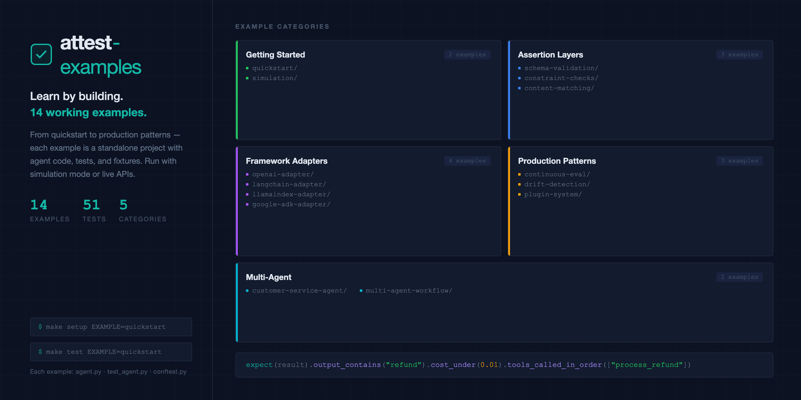

[](https://github.com/attest-framework/attest-examples)

---

# attest-examples

Showcase examples for [Attest](https://github.com/attest-framework/attest) — the AI agent evaluation framework.

---

## Getting Started

Start with [quickstart/](quickstart/) — a minimal end-to-end example that runs a single assertion against a live agent response.

```bash
make setup EXAMPLE=quickstart
make test EXAMPLE=quickstart
```

See [quickstart/README.md](quickstart/README.md) for a step-by-step walkthrough.

---

## Assertion Layers

Each example targets a specific layer of Attest's assertion stack.

| Example                                            | Layer                      | Description                                               |
| -------------------------------------------------- | -------------------------- | --------------------------------------------------------- |
| [semantic-similarity/](semantic-similarity/)       | L5 — Embeddings            | Cosine-similarity checks on response vectors              |
| [rag-chatbot/](rag-chatbot/)                       | L5 + Retrieval             | Embedding assertions combined with retrieval faithfulness |
| [llm-judge/](llm-judge/)                           | L6 — Quality gates         | LLM-as-judge scoring with pass/fail thresholds            |
| [simulation/](simulation/)                         | L7 — Mock tools & personas | Simulated tool calls and synthetic user personas          |
| [multi-agent-workflow/](multi-agent-workflow/)     | L8 — Trace trees           | Assertion over multi-hop agent trace graphs               |
| [customer-service-agent/](customer-service-agent/) | All 8 layers               | Full-stack evaluation across every assertion layer        |

---

## Framework Integrations

| Example                                | Description                                     |
| -------------------------------------- | ----------------------------------------------- |
| [langchain-agent/](langchain-agent/)   | Wrap a LangChain agent with Attest assertions   |
| [llamaindex-agent/](llamaindex-agent/) | Evaluate a LlamaIndex query pipeline            |
| [google-adk/](google-adk/)             | Assert over Google Agent Development Kit agents |
| [crewai-adapter/](crewai-adapter/)     | Plug Attest into a CrewAI multi-agent crew      |

---

## Production Patterns

| Example                              | Description                                   |
| ------------------------------------ | --------------------------------------------- |
| [continuous-eval/](continuous-eval/) | Run assertions in CI on every deployment      |
| [drift-detection/](drift-detection/) | Alert on assertion score regression over time |
| [plugin-system/](plugin-system/)     | Register custom assertion plugins             |

---

## Running Examples

```bash
# Set up and test a single example
make setup EXAMPLE=llm-judge
make test  EXAMPLE=llm-judge

# Run all examples in sequence
make test-all
```

Requires [uv](https://github.com/astral-sh/uv) and a `.env` file — see [`.env.example`](.env.example).

---

## Related

- [attest](https://github.com/attest-framework/attest) — SDK and core framework
- [attest-bench](https://github.com/attest-framework/attest-bench) — Benchmarks (private, for contributors)
- [attest-ai on PyPI](https://pypi.org/project/attest-ai/)

---

## License

[Apache-2.0](LICENSE)
